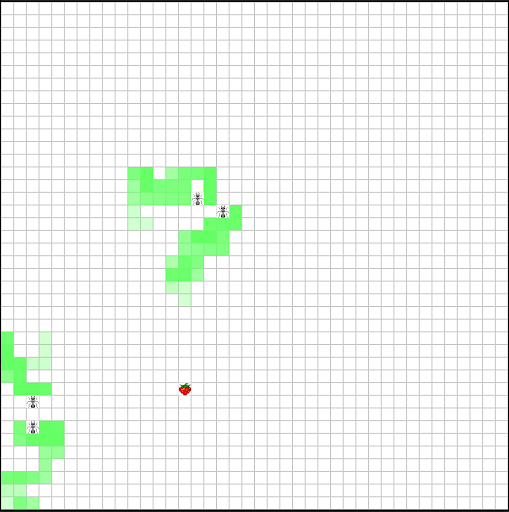
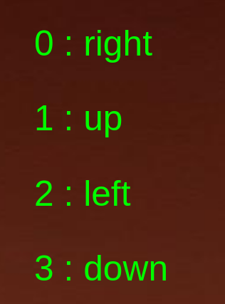
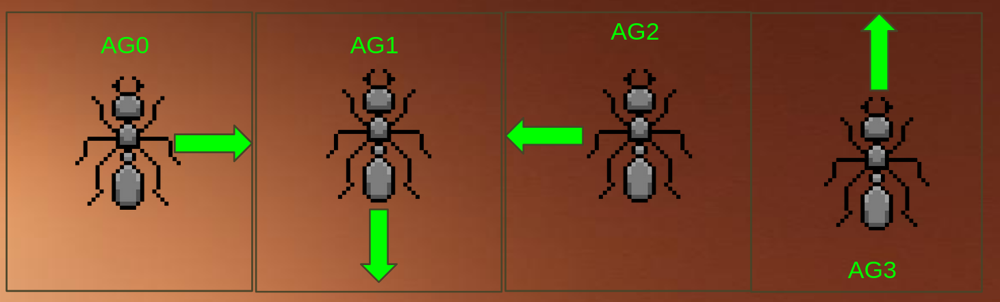

### Intro

- O que é aprendizagem por reforço?
  Metodologia de aprendizagem de máquina onde um agente aprende a resolver uma determinada tarefa por tentativa e erro.

O agente recebe um estado, proveniente do ambiente, determina uma ação à partir do estado e de sua função de decisão f(estado) -> ação e o ambiente atualiza o estado do agente à partir de sua ação e também fornece uma recompensa.

Com base no estado, na ação escolhida e na recompensa obtida, a função de decisão do agente é atualizada para maximizar a recompensa obtida.

 Exemplificando em alto nível:

```python
state = env.start()
action = agent.predict(state)
new_state, reward = env.step()
agent.learn(reward,state,action)
```

- O que é um ambiente?
  Simulação matemática capaz de receber ações de agentes e retornar estados resultantes.

Exemplo:
simulação de formigas em busca de comida, cada formiga é um agente distinto no mesmo ambiente:

<div align="center">
  
</div>

- O que é um estado?
  O estado é um vetor que representa as condições do agente em um determinado step ou momento de tempo no ambiente, ele contém medições que o agente é capaz de acessar naquele instante de tempo, com base nas quais o agente decide sua próxima ação.

exemplo de estado, no ambiente acima, cada formiga vê apenas o grid de células 5x5 ao seu redor:

<div align="center">
  
</div>

- O que é uma ação?
  Entre um estado e outro, o(s) agente(s) devem selecionar suas ações para aquele step, ou intervalo de tempo.

As ações escolhidas pelos agentes determinam seus estados futuros no ambiente e, consequentemente, suas recompensas.

Uma ação também depende do espaço de ação do agente no ambiente. A título de exemplo, no ambiente em questão, o espaço de ação de cada agente é um vetor de quatro dimensões:

```python
actionSpace = [0 1 2 3]
```

onde cada número corresponde à um sentido de movimentação no ambiente:

<div align="center">
  
</div>

Como existem 4 formigas no ambiente, o vetor de ação para cada instante é um dicionário como o seguinte:

```python
{"agent_0":0,"agent_1":3,"agent_2":2,"agent_3":1,}
```

E portanto, para o dicionário acima, cada agente tomaria as seguintes ações e seus estados seguintes seriam resultantes dessas movimentações:

<div align="center">
  
</div>

- O que são ambientes não deterministicos? Como eles interferem com o aprendizado do agente?

Ambientes não determinísticos adicionam ruído à lógica descrita, uma vez que as ações do agente não determinam inteiramente seus estados futuros e, portanto, também não determinam inteiramente suas recompensas.

Nesse caso se faz necessário uma função de decisão que seja capaz de lidar com esse não determinismo e abstrair quais ações são ideais para determinados estados na média. Um conjunto de dados -> numéro de experiências maior costuma ser necessário e uma função de decisão que aprende de forma mais devagar, mais estável, também costuma ser necessária.

- O que é uma função de recompensa?

Uma função de recompensa relaciona um determinado estado do agente à um número que reflete a performance do agente na execução da tarefa idealizada.

A título de exemplo, para o ambiente em questão, diferentes funções de recompensa podem ser elaboradas a depender do comportamento que o pesquisador deseja observar nos agentes.

Função 1: Agentes devem cooperar para chegar na recompensa.

```python
# 1 PARA TODOS AGENTES CASO ALGUM TENHA ATINGIDO A RECOMPENSA
# 0 PARA TODOS AGENTES CASO O CONTRÁRIO
def reward(env):
    if any(env.agents.pos == env.target.pos):
        return 100
    return 0
```

O objetivo da função acima seria maximizar a busca dos agentes no ambiente, isto é, como todos ganham recompensa caso 1 encontre o target, eles deveriam aprender que para maximizarem sua recompensa individual deveriam evitar percorrer caminhos já percorridos por outros agentes (indicados pelas células em verde, feromônios) e dessa forma, explorar o ambiente de forma mais eficiente.

Entretanto, é evidente que a função é muito esparsa, principalmente no início do treinamento, os agentes provavelmente demorariam a aprender que o target leva à uma alta recompensa e também possívelmente nem apresentariam o comportamento emergente descrito. Em suma, o aprendizado pode não convergir, ou pode exigir um número altíssimo de observações por parte dos agentes.

Função 2: Alternativa menos sparsa:
Para treinar os agentes de forma mais direcionada ao comportamento descrito, uma segunda função de treinamento poderia ser avaliada:

```python
# 100 PARA TODOS AGENTES CASO ALGUM TENHA ATINGIDO A RECOMPENSA
# -1 PARA TODOS AGENTES CASO ALGUM ESTEJA OCUPANDO UMA CÉLULA COM FEROMÔNIO
# +1 PARA TODOS AGENTES CASO ALGUM ESTEJA OCUPANDO UMA CÉLULA SEM FEROMÔNIO
def reward(env):
    reward_pool = 0
    if any(env.agents.pos == env.target.pos):
        return 100 # algum ja achou a recompensa, retorna 100 e mata o episodio

    for agent in agents:
        if env[agent.pos] == 3: # pheromone cell
            reward_pool -= 1
            continue
        else: # is not in pheromone cell
            reward_pool += 1
    return 1
      
    if 
    return 0
```

A função de recompensa **NÃO DEVE**: fornecer informação excessiva sobre o ambiente que o agente não terá acesso durante sua avaliação em um cenário real. Visto que nesse caso o agente aprenderia a repetir ações de alta recompensa, sem "compreensão" da lógica do ambiente. O agente aprenderia uma heurística que poderia ser implementada em código procedural sem necessidade de aprendizado por reforço.

Exemplo:
Uma função de recompensa que penaliza toda ação que não aproxima o agente da recompensa forneceria informação sobre onde está o target exatamente e não incentiva qualquer tipo de comportamento colaborativo.

Esse tipo de função que simplifica o problema pode ser aplicado em casos onde estamos aplicando ** Transfer learning **, como um passo intermediário no aprendizado do agente. Transfer learning consiste em treinar o agente em várias etapas sequenciais que aumentam em grau de realismo da função de recompensa, com a esperança de que o agente aprenda "conceitos" básicos em relação à sua tarefa para facilitar o aprendizado com a função de recompensa final, que pode ser muito esparsa ou muito complexa.

- Quais são as funções de decisão estudadas?

### Q-Learning

O Q-Learning é um método de **aprendizado tabular** usado em aprendizado por reforço. Esse método mapeia pares de **estado e ação** a valores (Q-valores), que representam a **expectativa de recompensa acumulada** que o agente espera obter ao executar uma ação em um estado e seguir a política ótima a partir daí.

Esses valores são atualizados com base na **recompensa recebida** e no valor máximo esperado das ações futuras. Assim, uma vez otimizado, para cada par $(s, a)$, existe um valor que estima o ganho total que o agente receberia ao tomar aquela ação naquele estado.

Dessa forma, quando treinado, o agente que utiliza Q-Learning irá, a cada novo estado, **consultar a Q-table** e selecionar, entre as ações disponíveis, aquela com o **maior Q-valor**.

#### Equação do Q-Learning

$$
Q(s, a) \leftarrow Q(s, a) + \alpha \left[ r + \gamma \max_{a'} Q(s', a') - Q(s, a) \right]
$$

* $Q(s, a)$: valor atual do par estado-ação
* $\alpha$: taxa de aprendizado (learning rate)
* $r$: recompensa recebida
* $\gamma$: fator de desconto
* $\max_{a'} Q(s', a')$: maior valor Q possível no próximo estado $s'$

Essa equação mostra que o valor Q atual é ajustado na direção de uma estimativa de recompensa futura, ponderada pela taxa de aprendizado.

### Hiperparâmetros importantes no Q-Learning

Os principais hiperparâmetros que controlam o comportamento do Q-Learning são:

* **Alpha (α) — Learning Rate:**
  Controla o quanto os novos valores influenciam a Q-table.
  Em ambientes não determinísticos, como o **Frozen Lake**, um valor muito alto de alpha pode fazer com que o agente aprenda padrões erráticos ou ruídos ao invés da dinâmica geral do ambiente.
* **Gamma (γ) — Fator de Desconto:**
  Determina o peso das recompensas futuras em relação às imediatas.
  Valores próximos de zero fazem o agente focar em recompensas imediatas, enquanto valores próximos de 1.0 incentivam o planejamento a longo prazo. Em muitos casos, utiliza-se γ ≈ 0.9 ou superior, especialmente quando há estados terminais com grande recompensa.
* **Epsilon (ε) — Fator de Exploração:**
  Controla a probabilidade de o agente tomar ações aleatórias em vez de seguir a política baseada na Q-table.
  Costuma-se iniciar com um valor alto (por exemplo, ε = 1.0), que **decresce gradualmente** ao longo do tempo. Isso permite que o agente explore o ambiente amplamente no início e, posteriormente, **exploite** o conhecimento adquirido.

### SARSA

O Q-Learning atualiza seus valores Q com base no **melhor valor Q** das ações disponíveis no próximo estado, ou seja, assume que o valor de uma determinada ação **a** é determinado pelo **máximo Q-valor** entre as ações possíveis no estado futuro **s'**. Essa lógica pressupõe que o agente sempre escolherá a ação de maior valor Q (política greedy).

Contudo, isso nem sempre acontece na prática. Existem hiperparâmetros como o **ε (epsilon)**, que introduzem exploração aleatória (**ε-greedy**), e ambientes estocásticos, como o **Frozen Lake**, onde o agente pode não executar a ação pretendida ou o ambiente pode não responder de forma determinística. Para lidar com isso, foi criado o algoritmo **SARSA**.

SARSA atualiza $Q(s,a)$ com base na **recompensa observada** da ação **realmente tomada** no próximo estado $s'$, ou seja, usa a ação $a'$ que o agente de fato escolheu seguindo sua política atual. Essa abordagem é chamada de **on-policy** e garante uma atualização mais realista dos valores Q com base nas recompensas e transições efetivamente vivenciadas, e não em estimativas ideais.

$$
Q(s, a) \leftarrow Q(s, a) + \alpha \left[r + \gamma Q(s', a') - Q(s, a)\right]
$$

" SARSA aprende com uma política "quase ótima". Um agente treinado com o algorítimo SARSA interage com o ambiente atualizando q_table com base nas ações efetivamente tomadas. Quando o problema envolve achar a solução ótima ou quando o número mínimo de ações deve ser tomada na resolução do problema, o algorítimo SARSA pode não se apresentar como a melhor escolha " - segundo slides de aula.

### Deep Q Learning

Em ambientes com espaços de ação e estado imensos, métodos tabulares como Q-learning e Sarsa tem imensa dificuldade em aprender, visto que não são capazes de atualizar estados similares, podem apenas atualizar os Q-valores de pares específicos (estado,ação). Em vista disso, em 2013 foi proposto um novo método de aprendizado que se propõe a usar uma rede neural no lugar da tabela, de modo a possibilitar generalizações e estimativas de valor para estados similares porém não idênticos à estados já vistos.

<div align="center">
  
</div>

- O número de entradas da rede deve ser igual ao espaço de observação do agente.
- O número de saídas da rede deve ser igual ao espaço de ação do agente.

A seleção de melhor ação deve acontecer segundo:

```python
action = self.model.predict(state)
return np.argmax(action[0])
```

A *loss function* usada para treinar a rede neural é a *mean squared error* (MSE):

L(θ) = (yᵗ - Q(sᵗ, aᵗ; θ))²

onde:

- `yᵗ` é o reward acumulado
- `Q(sᵗ, aᵗ; θ)` é o valor estimado pela rede neural
- Experience Replay

Treinar a rede em cada step traz um grande risco de overfitting, visto que as amostras são muito fortemente correlacionadas. Para fazer frente a tal risco, utiliza-se uma técnica chamada de experience replay.

Experience replay consiste de armazenar as experiências do agente em um momento t em um dataset e o treinamento do agente ocorre em cima de um batch de experiencias selecionadas aleatoriamente desse dataset.

`e_t = (s_t, a_t, r_t, s_{t+1})`

D = [e₁, ..., eₙ]


### Double DQN
foi visto em aula também uma versão do DQN onde há duas redes neurais, a value network, que de fato decide as ações do agente a cada step. E a target network, que fornece estimativas de target para a value network utilizar durante seu treinamento.

A target network é usada exclusivamente para fornecer valores alvo (target values) que servem como referência para a value network durante o processo de atualização. Quando a value network quer ajustar seus parâmetros para melhorar suas previsões (Q-values), ela compara suas estimativas atuais com esses valores alvo calculados pela target network. Isso ajuda a manter o aprendizado mais estável, evitando que as atualizações fiquem muito instáveis por causa de mudanças rápidas nos alvos.

### Reinforce

- O que é o algoritmo REINFORCE?
  Diferentemente dos algoritmos vistos anteriormente, que são value-based, o REINFORCE utiliza uma rede neural para retornar uma distribuição de probabilidade de escolha de cada ação para um dado estado. Ele define a policy em termos de:

π(s) = arg max_a Q(s, a)  (1)

Enquanto algoritmos como o Q-Learning e o DQN definem a policy no formato de uma distribuição:

a_t ~ π_θ(a|s_t)  (2)

onde θ representa os parâmetros da policy, e a ideia é atualizar esses parâmetros usando um gradiente ascendente para maximizar a expectativa de *reward* futuro. Para determinar essa distribuição, a rede neural utilizada é treinada para retornar, para cada estado, uma distribuição que maximiza a *reward*, ou seja, que maximiza a chance de uma ação ser escolhida que vai trazer uma maior recompensa para o agente.

- Qual a vantagem e principais diferenças de algoritmos policy based vs value based?
- Principais diferenças:

  - Abordagem: Policy-based otimiza a política diretamente (ex.: π(s) = arg max_a Q(s, a)), enquanto value-based estima valores (ex.: Q(s, a)) para derivar a política.
  - Ações: Policy-based suporta ações contínuas; value-based é mais comum em ações discretas.
    Estabilidade vs Exploração: Value-based tende a ser mais estável, mas pode explorar menos; policy-based explora mais, mas pode ser menos convergente.
  - Uso de redes neurais: Policy-based usa redes para distribuções (ex.: a_t ~ π_θ(a|s_t)), enquanto value-based usa para estimar Q-valores.
- Qual a diferença entre política e valor?

| Aspect           | Value-Based                    | Policy-Based                      |    |
| ---------------- | ------------------------------ | --------------------------------- | -- |
| Output           | Value function (e.g., Q(s, a)) | Policy π(a                       | s) |
| Action Selection | Argmax over values             | Sample from policy                |    |
| Suitable For     | Discrete action spaces         | Continuous or stochastic policies |    |
| Exploration      | Often needs ε-greedy          | Inherent via sampling             |    |

### Actor Critic

**Actor-Critic** é um método de *Reinforcement Learning* que combina um **ator**, responsável por escolher ações, com um **crítico**, responsável por avaliar a qualidade dessas ações com base no estado e na recompensa.

O algoritmo do sistema pode ser descrito como:

```
1. Initialize actor network π with random parameters φ
2. Initialize critic network V with random parameters θ
3. Repeat for every episode:
    4. for time step t = 0, 1, 2, ... do
        5. Observe current state s
        6. Sample action a ~ π(·|s; φ)
        7. Apply action a; observe reward r and next state s'
        8. if s' is terminal then
            9. Advantage Adv(s, a) ← r - V(s; θ)
            10. Critic target y ← r
        11. else
            12. Advantage Adv(s, a) ← r + γV(s'; θ) - V(s; θ)
            13. Critic target y ← r + γV(s'; θ)
        14. Actor loss ℒ(φ) ← -Adv(s, a) · log π(a|s; φ)
        15. Critic loss ℒ(θ) ← (y - V(s; θ))²
        16. Update parameters φ by minimizing the actor loss ℒ(φ)
        17. Update parameters θ by minimizing the critic loss ℒ(θ)
```

A imagem abaixo demonstra visualmente o sistema descrito:

<div align="center">
  
</div>

Explicando, o **crítico fornece feedback às ações do ator** por meio do cálculo da *advantage*, que é usada na otimização do ator. Em outras palavras, a *loss* do ator depende da *advantage* estimada pelo crítico.

Já a *advantage* depende da recompensa $r$ e das estimativas do crítico para o valor do estado atual e do próximo estado.

Por fim, o **crítico é otimizado** com base na diferença entre sua estimativa $V(s)$ e um alvo mais preciso $y$, que incorpora a recompensa imediata e, se aplicável, o valor esperado do próximo estado $V(s')$. Para estados não terminais, o alvo é ajustado com desconto $\gamma$, refletindo o valor futuro estimado.

No sistema descrito o actor é policy-based, isto é, sua saída é uma distribuição de probabilidade de chance de escolher cada ação. Já o critic é value based, uma vez que ele estima um valor para avaliar a policy escolhida pelo autor.

| Component | Type         | What it learns                           |  |
| --------- | ------------ | ---------------------------------------- | - |
| Actor     | Policy-based | The optimal policy pi(a)                 |  |
| Critic    | Value-based  | The value function$V(s)$ or $Q(s,a)$ |  |

- Qual a diferença de utilizar actor critic para outros métodos que usam simplesmente policy? Como reinforce tradicional?

Diferentemente dos algoritmos que utilizam a recompensa para otimizar diretamente a política, os algoritmos actor critic beneficiam-se de "críticas" ou "recompensas" com menor variância quando comparadas às recompensas diretamente atribuídas pelo ambiente. Dessa forma, o crítico serve para estabilizar e acelerar a convergência do aprendizado do ator, principalmente em ambientes não deterministicos e altamente complexos.

Geralmente, o critic reduz a variância do gradiente fornecido na otimização do agente e acelera a convergência de seu aprendizado.

- Resumo prático:

| Aspecto                     | REINFORCE (Policy only)                      | Actor-Critic                              |
| --------------------------- | -------------------------------------------- | ----------------------------------------- |
| O que é aprendido          | Apenas a política                           | Política e função de valor             |
| Tipo de feedback            | Retorno total do episódio (alta variância) | Estimativa da vantagem (menor variância) |
| Estabilidade do aprendizado | Menos estável e mais lento                  | Mais estável e rápido                   |
| Eficiência                 | Pode precisar de mais episódios             | Mais eficiente com menos dados            |

### PPO

PPO (Proximal Policy Optimization) é um algoritmo de aprendizado por reforço baseado no paradigma actor-critic, em que o ator (policy) escolhe as ações e o crítico (critic) estima o valor das ações ou estados.

Uma das principais inovações do PPO é o uso de uma função de perda com uma "clipping function" (Lclip), que restringe o quanto a política pode mudar em cada atualização. Isso é feito para evitar atualizações muito bruscas na política, que poderiam desestabilizar o aprendizado. Essa técnica torna o treinamento mais estável e melhora a velocidade de convergência.
Detalhes Técnicos :

A função Lclip é baseada na razão entre a nova política e a antiga:
r(θ)=πθ(a∣s)πθold(a∣s)
r(θ)=πθold(a∣s)πθ(a∣s)

A função de perda do ator é:


Onde:

    A^A^ é a vantagem estimada (advantage).

    ϵϵ é um hiperparâmetro (geralmente em torno de 0.1 a 0.2).

    O objetivo é evitar que r(θ)r(θ) se afaste muito de 1, limitando grandes atualizações.
