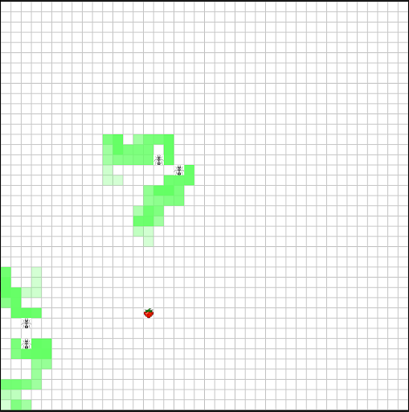
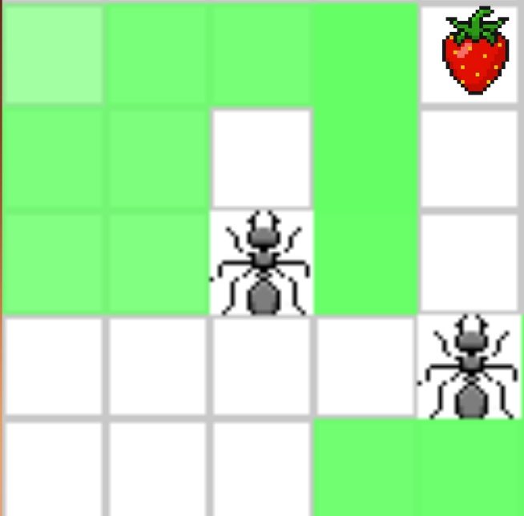
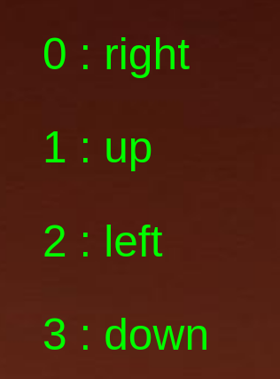
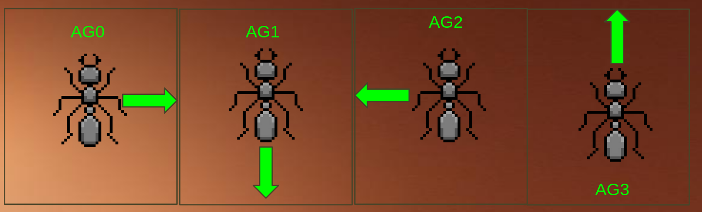

### Intro

- O que é aprendizagem por reforço?
Metodologia de aprendizagem de máquina onde um agente aprende a resolver uma determinada tarefa por tentativa e erro.

O agente recebe um estado, proveniente do ambiente, determina uma ação à partir do estado e de sua função de decisão f(estado) -> ação e o ambiente atualiza o estado do agente à partir de sua ação e também fornece uma recompensa.

Com base no estado, na ação escolhida e na recompensa obtida, a função de decisão do agente é atualizada para maximizar a recompensa obtida.

 Exemplificando em alto nível:

```python
state = env.start()
action = agent.predict(state)
new_state, reward = env.step()
agent.learn(reward,state,action)
```
- O que é um ambiente?
Simulação matemática capaz de receber ações de agentes e retornar estados resultantes.

Exemplo:
simulação de formigas em busca de comida, cada formiga é um agente distinto no mesmo ambiente:


- O que é um estado?
O estado é um vetor que representa as condições do agente em um determinado step ou momento de tempo no ambiente, ele contém medições que o agente é capaz de acessar naquele instante de tempo, com base nas quais o agente decide sua próxima ação.

exemplo de estado, no ambiente acima, cada formiga vê apenas o grid de células 5x5 ao seu redor:


- O que é uma ação?
Entre um estado e outro, o(s) agente(s) devem selecionar suas ações para aquele step, ou intervalo de tempo.

As ações escolhidas pelos agentes determinam seus estados futuros no ambiente e, consequentemente, suas recompensas.

Uma ação também depende do espaço de ação do agente no ambiente. A título de exemplo, no ambiente em questão, o espaço de ação de cada agente é um vetor de quatro dimensões:

```python
actionSpace = [0 1 2 3]
```
onde cada número corresponde à um sentido de movimentação no ambiente:


Como existem 4 formigas no ambiente, o vetor de ação para cada instante é um dicionário como o seguinte:
```python
{"agent_0":0,"agent_1":3,"agent_2":2,"agent_3":1,}
```
E portanto, para o dicionário acima, cada agente tomaria as seguintes ações e seus estados seguintes seriam resultantes dessas movimentações:


- O que são ambientes não deterministicos? Como eles interferem com o aprendizado do agente?

Ambientes não determinísticos adicionam ruído à lógica descrita, uma vez que as ações do agente não determinam inteiramente seus estados futuros e, portanto, também não determinam inteiramente suas recompensas.

Nesse caso se faz necessário uma função de decisão que seja capaz de lidar com esse não determinismo e abstrair quais ações são ideais para determinados estados na média. Um conjunto de dados -> numéro de experiências maior costuma ser necessário e uma função de decisão que aprende de forma mais devagar, mais estável, também costuma ser necessária. 

- O que é uma função de recompensa?

Uma função de recompensa relaciona um determinado estado do agente à um número que reflete a performance do agente na execução da tarefa idealizada.

A título de exemplo, para o ambiente em questão, diferentes funções de recompensa podem ser elaboradas a depender do comportamento que o pesquisador deseja observar nos agentes.

Função 1: Agentes devem cooperar para chegar na recompensa.
```python
# 1 PARA TODOS AGENTES CASO ALGUM TENHA ATINGIDO A RECOMPENSA
# 0 PARA TODOS AGENTES CASO O CONTRÁRIO
def reward(env):
    if any(env.agents.pos == env.target.pos):
        return 100
    return 0
```
O objetivo da função acima seria maximizar a busca dos agentes no ambiente, isto é, como todos ganham recompensa caso 1 encontre o target, eles deveriam aprender que para maximizarem sua recompensa individual deveriam evitar percorrer caminhos já percorridos por outros agentes (indicados pelas células em verde, feromônios) e dessa forma, explorar o ambiente de forma mais eficiente.

Entretanto, é evidente que a função é muito esparsa, principalmente no início do treinamento, os agentes provavelmente demorariam a aprender que o target leva à uma alta recompensa e também possívelmente nem apresentariam o comportamento emergente descrito. Em suma, o aprendizado pode não convergir, ou pode exigir um número altíssimo de observações por parte dos agentes.

Função 2: Alternativa menos sparsa:
Para treinar os agentes de forma mais direcionada ao comportamento descrito, uma segunda função de treinamento poderia ser avaliada:
```python
# 100 PARA TODOS AGENTES CASO ALGUM TENHA ATINGIDO A RECOMPENSA
# -1 PARA TODOS AGENTES CASO ALGUM ESTEJA OCUPANDO UMA CÉLULA COM FEROMÔNIO
# +1 PARA TODOS AGENTES CASO ALGUM ESTEJA OCUPANDO UMA CÉLULA SEM FEROMÔNIO
def reward(env):
    reward_pool = 0
    if any(env.agents.pos == env.target.pos):
        return 100 # algum ja achou a recompensa, retorna 100 e mata o episodio

    for agent in agents:
        if env[agent.pos] == 3: # pheromone cell
            reward_pool -= 1
            continue
        else: # is not in pheromone cell
            reward_pool += 1
    return 1
        
    if 
    return 0
```


A função de recompensa * NÃO DEVE *: fornecer informação excessiva sobre o ambiente que o agente não terá acesso durante sua avaliação em um cenário real. Visto que nesse caso o agente aprenderia a repetir ações de alta recompensa, sem "compreensão" da lógica do ambiente. O agente aprenderia uma heurística que poderia ser implementada em código procedural sem necessidade de aprendizado por reforço.

Exemplo:
Uma função de recompensa que penaliza toda ação que não aproxima o agente da recompensa forneceria informação sobre onde está o target exatamente e não incentiva qualquer tipo de comportamento colaborativo.

Esse tipo de função que simplifica o problema pode ser aplicado em casos onde estamos aplicando ** Transfer learning **, como um passo intermediário no aprendizado do agente. Transfer learning consiste em treinar o agente em várias etapas sequenciais que aumentam em grau de realismo da função de recompensa, com a esperança de que o agente aprenda "conceitos" básicos em relação à sua tarefa para facilitar o aprendizado com a função de recompensa final, que pode ser muito esparsa ou muito complexa.


- Quais são as funções de decisão estudadas?

### Q-Learning

O Q-Learning é um método de **aprendizado tabular** usado em aprendizado por reforço. Esse método mapeia pares de **estado e ação** a valores (Q-valores), que representam a **expectativa de recompensa acumulada** que o agente espera obter ao executar uma ação em um estado e seguir a política ótima a partir daí.

Esses valores são atualizados com base na **recompensa recebida** e no valor máximo esperado das ações futuras. Assim, uma vez otimizado, para cada par $(s, a)$, existe um valor que estima o ganho total que o agente receberia ao tomar aquela ação naquele estado.

Dessa forma, quando treinado, o agente que utiliza Q-Learning irá, a cada novo estado, **consultar a Q-table** e selecionar, entre as ações disponíveis, aquela com o **maior Q-valor**.

#### Equação do Q-Learning

$$
Q(s, a) \leftarrow Q(s, a) + \alpha \left[ r + \gamma \max_{a'} Q(s', a') - Q(s, a) \right]
$$

* $Q(s, a)$: valor atual do par estado-ação
* $\alpha$: taxa de aprendizado (learning rate)
* $r$: recompensa recebida
* $\gamma$: fator de desconto
* $\max_{a'} Q(s', a')$: maior valor Q possível no próximo estado $s'$

Essa equação mostra que o valor Q atual é ajustado na direção de uma estimativa de recompensa futura, ponderada pela taxa de aprendizado.

### Hiperparâmetros importantes no Q-Learning

Os principais hiperparâmetros que controlam o comportamento do Q-Learning são:

* **Alpha (α) — Learning Rate:**
  Controla o quanto os novos valores influenciam a Q-table.
  Em ambientes não determinísticos, como o **Frozen Lake**, um valor muito alto de alpha pode fazer com que o agente aprenda padrões erráticos ou ruídos ao invés da dinâmica geral do ambiente.

* **Gamma (γ) — Fator de Desconto:**
  Determina o peso das recompensas futuras em relação às imediatas.
  Valores próximos de zero fazem o agente focar em recompensas imediatas, enquanto valores próximos de 1.0 incentivam o planejamento a longo prazo. Em muitos casos, utiliza-se γ ≈ 0.9 ou superior, especialmente quando há estados terminais com grande recompensa.

* **Epsilon (ε) — Fator de Exploração:**
  Controla a probabilidade de o agente tomar ações aleatórias em vez de seguir a política baseada na Q-table.
  Costuma-se iniciar com um valor alto (por exemplo, ε = 1.0), que **decresce gradualmente** ao longo do tempo. Isso permite que o agente explore o ambiente amplamente no início e, posteriormente, **exploite** o conhecimento adquirido.


### SARSA

O Q-Learning atualiza seus valores Q com base no **melhor valor Q** das ações disponíveis no próximo estado, ou seja, assume que o valor de uma determinada ação **a** é determinado pelo **máximo Q-valor** entre as ações possíveis no estado futuro **s'**. Essa lógica pressupõe que o agente sempre escolherá a ação de maior valor Q (política greedy).

Contudo, isso nem sempre acontece na prática. Existem hiperparâmetros como o **ε (epsilon)**, que introduzem exploração aleatória (**ε-greedy**), e ambientes estocásticos, como o **Frozen Lake**, onde o agente pode não executar a ação pretendida ou o ambiente pode não responder de forma determinística. Para lidar com isso, foi criado o algoritmo **SARSA**.

SARSA atualiza $Q(s,a)$ com base na **recompensa observada** da ação **realmente tomada** no próximo estado $s'$, ou seja, usa a ação $a'$ que o agente de fato escolheu seguindo sua política atual. Essa abordagem é chamada de **on-policy** e garante uma atualização mais realista dos valores Q com base nas recompensas e transições efetivamente vivenciadas, e não em estimativas ideais.

$$
Q(s, a) \leftarrow Q(s, a) + \alpha \left[r + \gamma Q(s', a') - Q(s, a)\right]
$$

### Deep Q Learning
Em ambientes com espaços de ação e estado imensos, métodos tabulares como Q-learning e Sarsa tem imensa dificuldade em aprender, visto que não são capazes de atualizar estados similares, podem apenas atualizar os Q-valores de pares específicos (estado,ação). Em vista disso, em 2013 foi proposto um novo método de aprendizado que se propõe a usar uma rede neural no lugar da tabela, de modo a possibilitar generalizações e estimativas de valor para estados similares porém não idênticos à estados já vistos.


- O número de entradas da rede deve ser igual ao espaço de observação do agente.
- O número de saídas da rede deve ser igual ao espaço de ação do agente.

A seleção de melhor ação deve acontecer segundo:
```python
action = self.model.predict(state)
return np.argmax(action[0])
```

A *loss function* usada para treinar a rede neural é a *mean squared error* (MSE):

L(θ) = (yᵗ - Q(sᵗ, aᵗ; θ))²

onde:
- `yᵗ` é o reward acumulado
- `Q(sᵗ, aᵗ; θ)` é o valor estimado pela rede neural

- Experience Replay

Treinar a rede em cada step traz um grande risco de overfitting, visto que as amostras são muito fortemente correlacionadas. Para fazer frente a tal risco, utiliza-se uma técnica chamada de experience replay.

Experience replay consiste de armazenar as experiências do agente em um momento t em um dataset e o treinamento do agente ocorre em cima de um batch de experiencias selecionadas aleatoriamente desse dataset.

`e_t = (s_t, a_t, r_t, s_{t+1})` 

D = [e₁, ..., eₙ]

### Actor Critic

### A2C

### PPO